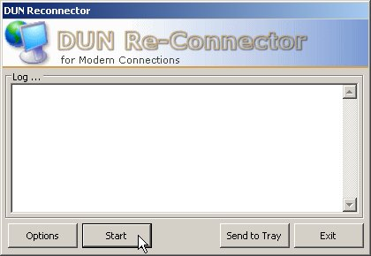



## Dial\-Up Auto\-Reconnector for Modems

### Description

This program is for those of us who suffer from modem-based internet connections, and ISPs who cut the connection at intervals. The program sits in your system tray, and will monitor your dial-up connection. If it drops, the program will automatically dial your chosen connection, and re-establish your internet link (with an optional delay setting - to get round ISPs who allocate a low-speed line if you immediately re-connect). There are quite a few other programs like this on the site, but I didn't see any that did the job quite as simply as this. I hope you find it useful. Happy (slow) downloading!
 
### More Info
 

             |
---                |---
**Submitted On**   |2003-12-27 06:35:02
**By**             |[James Kerr](https://github.com/Planet-Source-Code/PSCIndex/blob/master/ByAuthor/james-kerr.md)
**Level**          |Intermediate
**User Rating**    |5.0 (15 globes from 3 users)
**Compatibility**  |VB 5\.0, VB 6\.0
**Category**       |[Complete Applications](https://github.com/Planet-Source-Code/PSCIndex/blob/master/ByCategory/complete-applications__1-27.md)
**World**          |[Visual Basic](https://github.com/Planet-Source-Code/PSCIndex/blob/master/ByWorld/visual-basic.md)
**Archive File**   |[Dial\-Up\_Au16871512272003\.zip](https://github.com/Planet-Source-Code/james-kerr-dial-up-auto-reconnector-for-modems__1-50629/archive/master.zip)

